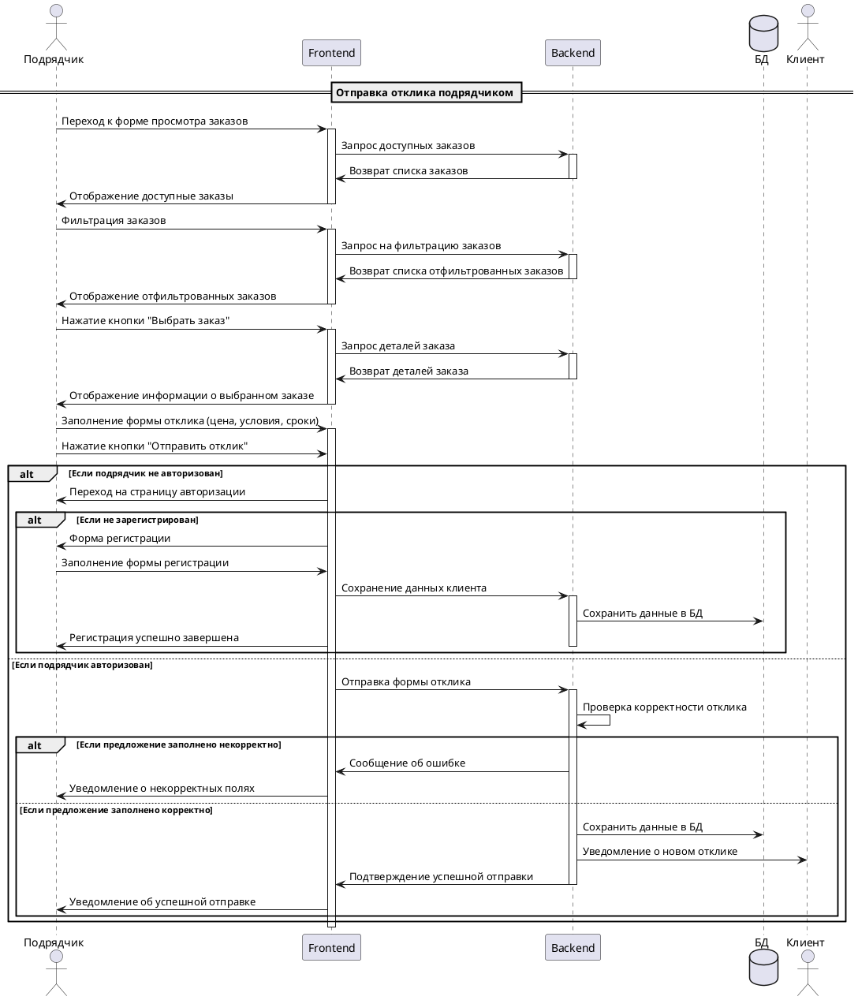

# Сценарий отправки отклика подрядчиком

## Описание алгоритма:

1. **Подрядчик** переходит к форме просмотра заказов.
2. **Frontend** запрашивает список доступных заказов у **Backend**.
3. **Backend** возвращает список заказов, которые затем отображаются в **Frontend**.
4. **Подрядчик** может фильтровать заказы.
5. **Frontend** отправляет запрос на фильтрацию и получает отфильтрованный список заказов.
6. **Подрядчик** выбирает заказ и запрашивает его детали.
7. **Frontend** отображает информацию о выбранном заказе.
8. **Подрядчик** заполняет форму отклика, указывая цену, условия и сроки.
   - Если **Подрядчик** не авторизован:
     - Его перенаправляют на страницу авторизации. 
       - Если он не зарегистрирован, предоставляют ему форму регистрации. После заполнения формы данные о клиенте сохраняются в **Backend** и **Database**.
   - Если **Подрядчик** авторизован, 
     - **Frontend** отправляет отклик в **Backend**. **Backend** проверяет корректность отклика:
       - Если отклик некорректен, то отображается сообщение об ошибке.
       - Если отклик корректен, данные сохраняются в **Database**, и **Клиент** получает уведомление о новом отклике. **Frontend** уведомляет **Подрядчика** об успешной отправке отклика. 

---

### Описание участников диаграммы

| Параметр | Описание                               |
| -------- | -------------------------------------- |
| Подрядчик    | Пользователь, который создает питомца. |
| Build Finder System  | Система, которая обрабатывает запросы. |
| Database   |  База данных, в которой хранятся данные о пользователях. |
