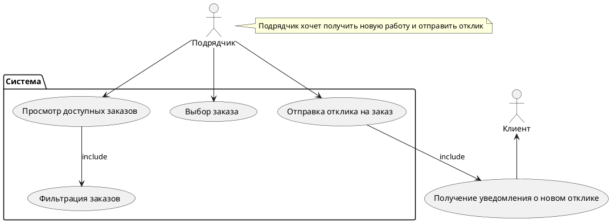

# Сценарий отправки отклика подрядчиком

## Описание использования:

**Подрядчик** (actor) инициирует процесс взаимодействия с системой. Он может выполнять несколько действий, в том числе просматривать доступные заказы, фильтровать их и отправлять отклики на выбранные заказы.

Использование случаев (use cases):

1. Просмотр доступных заказов (UC2): **Подрядчик** имеет возможность изучить все актуальные предложения от клиентов.

2. Фильтрация заказов (UC3): В данном случае **подрядчик** может сузить результаты поиска, используя определённые фильтры, чтобы найти заказы, которые соответствуют его критериям.

3. Выбор заказа (UC4): После просмотра и фильтрации заказов, **подрядчи** выбирает интересующий его заказ для получения дополнительных деталей.

4. Отправка отклика на заказ (UC5): **Подрядчик** заполняет форму отклика на выбранный заказ, указывая свои условия и отправляет отклик.

5. Получение уведомления о новом отклике (UC6): После того как **подрядчик** отправляет отклик, **клиент** получает уведомление о новом отклике, что сигнализирует о том, что на его **заказ** поступили предложения.

---

## Связи и зависимости:

Отметка include показывает, что некоторые действия связаны друг с другом. Например, "Фильтрация заказов" является включенной частью процесса "Просмотр доступных заказов", что отражает логику использования.

Аналогично, "Получение уведомления о новом отклике" является включенной частью процесса "Отправка отклика на заказ".

---

## Контекст:

Подрядчик (actor) хочет найти новую работу и отправить отклик каждому заказу, который ему интересен. Таким образом, данный элемент сценария представляет ключевую часть бизнес-логики приложения BuildFinder и показывает, как подрядчики взаимодействуют с системой и клиентами.
Эта диаграмма использования иллюстрирует основные взаимодействия пользователей с системой и помогает понять бизнес-процессы, связанные с отправкой откликов подрядчиками.

---